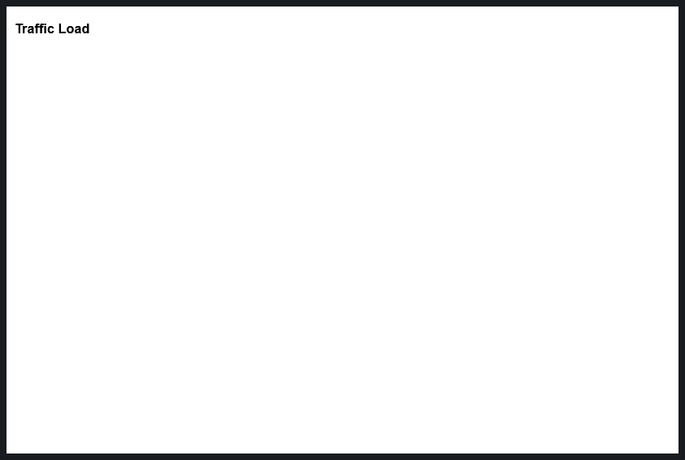

<center></center>

<center>
# Grafana Network Weathermap Plugin
</center>

## Installation

### Installing on a local Grafana:

For local instances, plugins are installed and updated via a simple CLI command. Plugins are not updated automatically, however you will be notified when updates are available right within your Grafana.

#### 1: Install the Panel

Use the grafana-cli tool to install Network Weathermap from the commandline:

```grafana-cli plugins install knightss27-weathermap-panel```

The plugin will be installed into your grafana plugins directory; the default is /var/lib/grafana/plugins. [More information on the cli tool.](https://grafana.com/docs/grafana/latest/administration/cli/#plugins-commands)

Alternatively, you can manually download the .zip file from the [latest release](https://github.com/knightss27/grafana-network-weathermap/releases/latest/) and unpack it into your grafana plugins directory.


#### 2: Add the Panel to a Dashboard

Installed panels are available immediately in the Dashboards section in your Grafana main menu, and can be added like any other core panel in Grafana.

To see a list of installed panels, click the Plugins item in the main menu. Both core panels and installed panels will appear.

### Testing

For testing with Docker, follow the instructions on the [testing README](https://github.com/knightss27/grafana-network-weathermap/tree/main/testing#readme). This will provide you with an instance to play around with.

---
## Creating a New Weathermap

1. In Grafana, create a new `Empty Panel`.
2. Change the visualisation in the top right corner to `Network Weathermap`.
3. You now have a brand new network weathermap panel! 🎉
4. Learn about weathermap basics below!

---

## On Startup

By default, the panel will start completely blank, looking something like this:



### Adding Nodes

- Make sure you have selected `Edit` on the panel in Grafana.
- On the right hand side, find the `Nodes` editor.

    

- Click `Add Node` to create a new node.
- Nodes have three basic fields:
    - X position (`number`): Node's X position.
    - Y position (`number`): Node's Y position.
    - Label (`string`): The text visible on the node.
- You can then move the node by dragging it with your mouse.

### Adding Links

- Ensure you have at least two nodes.
- On the right hand side, find the `Links` editor.

    

- Click `Add Link` to create a new link.
- Links are split into two sides, `A` and `B`.
- Each side has four central fields:
    - Side (`Node`): The node this side of the link connects to.
    - Query (`Query`): A query representing the current side's throughput in the specified units.
    - Bandwidth # (`number`): A number representing the bandwidth of this side in specified units.
    - Bandwidth Query (`Query`): A query representing the bandwidth of this side in the specified units.
    - Units (`unit`): The units the link expects to recieve its data as. This is used for both the main query and bandwidth. Defaults to `bits/sec (SI)` (`bps`).
- Select `A` and `B` side nodes from their respective dropdowns.

### Adding Data

- The weathermap expects a data frame with two fields, a time and a number.
- You probably want this number in `bits/sec`, unless your links are expecting something else (each link has customizable units, and default units are customizable in the global settings for the panel).
- The weathermap will always choose the most recent data point available. If you want your links graphs to have data, make sure your queries are ranges and not "Instant" queries, as this will mean there is no data to show on each graph.
- Once you have added a query in the panel editor, you can can see all queries and select one from the dropdown in the Query fields of the links.
- See the [FAQ](/faq) or [Github issues](https://github.com/knightss27/grafana-network-weathermap/issues) if you are having issues adding data (especially Zabbix datasource users).

**PLEASE NOTE:** _Queries with the exact same labels will be considered as such. If you have multiple queries and are unable to select the one that you want, double check to make sure it is labeled uniquely._

### Setting Thresholds

- The weathermap color scale allows you to color links based on their bandwidth usage.
- On the right hand side, find the `Color Scale` editor.
  
- Click `Add Scale Value` to create a new threshold.
- Each threshold has two basic fields:
    - % (`number`): The percent of bandwidth usage at which to _start_ this threshold.
    - Color (`picker`): The color of this threshold, can be any valid CSS `color` chosen or input with the picker.
        - `green` | `#00FF00` | `rgb(0, 255, 0)`
- By default, the scale will fill from the highest threshold to 100%. You can see the scale in the top left of the panel. When updating numerical values, click off of the input when you're finished to allow the scale to update.

### Interacting with the Weathermap

- In editing mode:
    - `Click + Drag` nodes to move them.
    - `Shift + Drag` or hold and drag `Middle Mouse` to move the map.
    - `Scroll` to zoom.
    - `Ctrl + Click` to select/deselect multiple nodes before dragging.
    - `Double Click` to deselect all nodes.
- Outside of editing mode (including read-only users):
    - `Shift + Scroll` to zoom.
    - `Shift + Drag` to move the map.
- Hover over links to see tooltip information.
    - Hold `Shift` while hovering to free up the mouse.
    - Hover over the same link or another to unfreeze the tooltip.